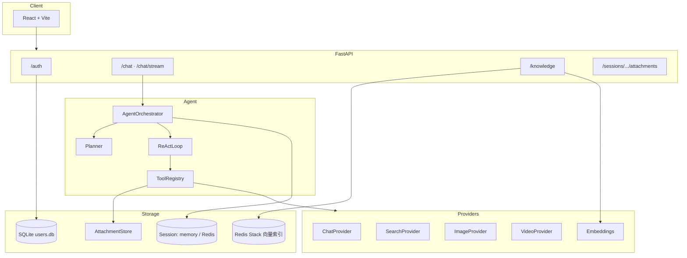

# Atelier 智能助手 · FastAPI ReAct Agent

面向实训与课程场景的**多模态对话智能体**：基于 FastAPI + ReAct 工具循环，支持日常对话、联网检索、知识库 RAG、文生图/文生视频、附件解析与代码沙箱；配套 React 前端，提供 SSE 流式体验与用户隔离的会话管理。

> 默认可在 Mock Provider 下本地运行；接入 [火山方舟](https://console.volcengine.com/ark) 后即可使用 Doubao 对话、Seedream 绘图、Seedance 视频与向量嵌入等真实能力。

---

## 目录

- [功能特性](#功能特性)
- [系统架构](#系统架构)
- [技术栈](#技术栈)
- [环境要求](#环境要求)
- [快速开始](#快速开始)
- [配置说明](#配置说明)
- [项目结构](#项目结构)
- [API 概览](#api-概览)
- [知识库与 RAG](#知识库与-rag)
- [开发与测试](#开发与测试)
- [安全说明](#安全说明)
- [许可证](#许可证)

---

## 功能特性

### 对话与 Agent

| 能力 | 说明 |
|------|------|
| **ReAct 工具循环** | 每轮对话带 `run_id`；完整 assistant 工具调用 + tool observation 写入会话，支持多轮回放 |
| **任务规划** | 复杂需求或带附件时自动生成步骤计划（SSE `plan_created`），按计划多步执行 |
| **真流式输出** | LLM `stream=true` 推送 `delta`；支持前端「停止」取消，未完成 trace 不持久化 |
| **步数上限** | 达到 `AGENT_MAX_STEPS` 时发送 `step_limit` 并强制汇总回答 |
| **意图识别** | 自动区分 `chat` / `search` / `image` / `video`；实时类问题走搜索流程 |

### 工具集

| 工具 | 用途 |
|------|------|
| `web_search` | 联网搜索（火山 Mercury / FeedCoop 网关） |
| `fetch_url` | 网页深度阅读（httpx + trafilatura），支持「先搜再读」 |
| `search_knowledge` | 知识库向量检索（Redis Stack + 嵌入模型） |
| `parse_document` | 解析当前会话 PDF/文本附件 |
| `analyze_image` | 多模态识图 |
| `calculator` | 安全表达式计算 |
| `run_python` | 本机 Python 沙箱执行（实训/demo） |
| `generate_image` | 文生图（Seedream 等） |
| `generate_video` | 文生视频 / 图生视频（Seedance 等） |

### 知识库（RAG）

- 上传课程/实验文档 → 分块 → Redis Stack 向量索引
- 对话首轮可自动检索注入上下文；回答支持 `[1][2]` 引用，前端展示来源片段
- **两种模式**：「按知识库回答」（仅 `search_knowledge`）与「联网模式」（`web_search` / `fetch_url`）

### 前端（`frontend/`）

- 注册/登录、JWT 鉴权、按用户隔离会话与附件
- 侧栏会话列表、知识库面板、任务计划面板、工具结果面板
- Markdown 渲染、附件预览、流式状态提示（搜索/绘图/解析等）

### 生产向能力

- 用户名密码 + JWT；可选 `API_KEY` 网关二次校验
- 按用户 `session_id` 限流；工具超时、可重试退避、同轮独立工具并行
- `GET /health` / `GET /health/ready`（Redis、LLM、知识库状态）

---

## 系统架构



**SSE 事件类型**：`run_started` · `plan_created` · `step_started` · `tool_started` · `tool_result` · `delta` · `final` · `step_limit`

---

## 技术栈

| 层级 | 技术 |
|------|------|
| 后端 | Python 3.10+、FastAPI、Pydantic Settings、httpx、Redis、redisvl、PyJWT、aiosqlite |
| 前端 | React、TypeScript、Vite、react-markdown |
| 向量/RAG | Redis Stack（RediSearch）、火山方舟多模态 Embedding |
| 默认 LLM | 火山方舟 Doubao-Seed-2.0-lite（可换 OpenAI 兼容接口） |

---

## 环境要求

- **Python** ≥ 3.10
- **Node.js** ≥ 18（前端开发）
- **Redis Stack**（可选，会话持久化 + 知识库向量；仅内存模式可不装）
- **Docker**（推荐，一键启动 Redis Stack）

---

## 快速开始

### 1. 克隆与安装后端

```powershell
git clone <your-repo-url>
cd 实训agent

python -m pip install -e ".[dev]"
```

### 2. 环境变量

复制模板并编辑（字段说明见 [配置说明](#配置说明)）。**未配置 LLM/搜索密钥时**，测试与本地开发会使用 Mock Provider。

```powershell
copy .env.example .env
# 编辑 .env：实训演示建议保持 USE_MOCK_PROVIDERS=true，并设置 ≥32 字符的 JWT_SECRET
# 本地 pytest 会自动 USE_MOCK_PROVIDERS=true，避免请求真实 API
```

### 3. 启动后端

```powershell
uvicorn app.main:app --reload
```

- API 文档：http://127.0.0.1:8000/docs  
- 健康检查：http://127.0.0.1:8000/health  

### 4. 启动前端

```powershell
cd frontend
npm install
copy .env.example .env
npm run dev
# 交付前自检：npm run typecheck && npm test && npm run build
```

浏览器访问 http://127.0.0.1:5173（Vite 将 `/api` 代理到 `http://127.0.0.1:8000`）。

### 5. （可选）Redis Stack

知识库与 Redis 会话存储需要 **Redis Stack**：

```powershell
docker run -d --name agent-redis-stack -p 6379:6379 redis/redis-stack-server:latest
```

`.env` 中设置：

```env
SESSION_STORE=redis
REDIS_URL=redis://127.0.0.1:6379/0
KNOWLEDGE_ENABLED=true
```

---

## 配置说明

配置通过根目录 `.env` 注入，字段定义见 `app/core/config.py`。

### 火山方舟对话（推荐）

```env
LLM_API_BASE_URL=https://ark.cn-beijing.volces.com/api/v3
LLM_API_KEY=                    # 可留空，自动使用 ARK_API_KEY
ARK_CHAT_ENDPOINT_ID=ep-xxxxxxxx  # 推理接入点 ID（推荐）
LLM_MODEL=doubao-seed-2-0-lite-260215
VISION_MODEL=doubao-seed-2-0-lite-260215
MULTIMODAL_INLINE_ATTACHMENTS=true
ARK_API_KEY=your-ark-api-key
```

若报错 `has not activated the model`，请在 [火山方舟控制台](https://console.volcengine.com/ark) 开通模型并创建 `ep-` 接入点。

### 搜索 / 绘图 / 视频

```env
# 搜索：优先火山 AK/SK（Mercury WebSearch），否则 SEARCH_API_BASE_URL + KEY
SEARCH_API_AKSK_URL=
SEARCH_API_BASE_URL=
SEARCH_API_KEY=

IMAGE_API_BASE_URL=
IMAGE_API_KEY=
VIDEO_TASKS_URL=
VIDEO_TASK_STATUS_URL_TEMPLATE=
```

### 会话、Agent、附件

```env
SESSION_STORE=memory          # memory | redis
REDIS_URL=redis://127.0.0.1:6379/0
ENABLE_AGENT_PLANNING=true
AGENT_MAX_STEPS=10
ATTACHMENTS_DIR=data/attachments
ATTACHMENT_MAX_BYTES=5242880
CODE_EXEC_TIMEOUT_SECONDS=10
```

### 知识库

```env
KNOWLEDGE_ENABLED=true
EMBEDDING_MODEL=doubao-embedding-vision-251215
EMBEDDING_DIMENSIONS=2048      # 须与模型一致；变更后重启会自动重建索引
KNOWLEDGE_CHUNK_SIZE=800
KNOWLEDGE_TOP_K=5
KNOWLEDGE_AUTO_RETRIEVE=true
```

> 嵌入模型走 `/embeddings/multimodal`，默认 **2048** 维。修改模型或维度后需重启后端。

### 鉴权与限流

```env
JWT_SECRET=your-long-random-secret-at-least-32-chars
AUTH_ENABLED=true
USERS_DB_PATH=data/users.db
API_KEY=                        # 可选；前端 VITE_API_KEY 需一致
RATE_LIMIT_REQUESTS=30
RATE_LIMIT_WINDOW_SECONDS=60
```

前端 `frontend/.env`：

```env
VITE_API_KEY=
```

### Mock 模式

```env
USE_MOCK_PROVIDERS=true         # 无真实 API 密钥时使用占位实现
```

---

## 项目结构

```
实训agent/
├── app/
│   ├── main.py              # FastAPI 入口与生命周期
│   ├── api/                 # 聊天、附件、健康检查、限流
│   ├── auth/                # 注册登录、JWT、用户存储
│   ├── agent/               # Orchestrator、Planner、ReAct、工具
│   ├── knowledge/           # 分块、嵌入、向量检索、REST
│   ├── providers/           # LLM / 搜索 / 图 / 视频（可扩展）
│   └── storage/             # 会话、附件、Redis
├── frontend/                # React 单页应用
├── tests/                   # pytest 用例
├── scripts/                 # 辅助脚本（如 ping_redis）
└── pyproject.toml
```

**扩展真实 API**：在 `app/providers/` 实现 `base.py` 中的协议，并在 `factory.py` 中注册；Mock 实现见 `mock.py`。

---

## API 概览

| 方法 | 路径 | 说明 |
|------|------|------|
| `POST` | `/auth/register` | 注册 |
| `POST` | `/auth/login` | 登录，返回 JWT |
| `POST` | `/chat` | 同步聊天 |
| `POST` | `/chat/stream` | SSE 流式聊天 |
| `GET` | `/sessions/{id}` | 会话历史 |
| `POST` | `/sessions/{id}/attachments` | 上传附件 |
| `GET/POST/DELETE` | `/knowledge/documents` | 知识库文档管理 |
| `GET` | `/health` · `/health/ready` | 健康与就绪检查 |

请求头（业务接口）：`Authorization: Bearer <access_token>`；若配置了 `API_KEY`，另加 `X-API-Key`。

### 示例：注册与流式对话

```powershell
curl -X POST "http://127.0.0.1:8000/auth/register" `
  -H "Content-Type: application/json" `
  -d "{\"username\":\"demo\",\"password\":\"password123\"}"

curl -X POST "http://127.0.0.1:8000/auth/login" `
  -H "Content-Type: application/json" `
  -d "{\"username\":\"demo\",\"password\":\"password123\"}"

curl -N -X POST "http://127.0.0.1:8000/chat/stream" `
  -H "Content-Type: application/json" `
  -H "Authorization: Bearer <access_token>" `
  -d "{\"session_id\":\"demo\",\"message\":\"今天有什么 AI 新闻？\"}"
```

### 示例：附件上传

```powershell
curl -X POST "http://127.0.0.1:8000/sessions/demo/attachments" `
  -H "Authorization: Bearer <access_token>" `
  -F "files=@C:\path\to\lab-manual.pdf"
```

聊天 JSON 中传入返回的 `attachments` ID 列表即可。

---

## 知识库与 RAG

### 工作流

1. 通过 API 或前端「知识库」面板上传 PDF / txt / md  
2. 服务分块并向量化，写入 Redis Stack  
3. 对话时（`use_knowledge_base=true`）自动检索或调用 `search_knowledge`  
4. 模型依据片段作答，证据不足时需明确说明，不得编造  

### API 示例

```powershell
curl "http://127.0.0.1:8000/knowledge/documents" -H "Authorization: Bearer <token>"

curl -X POST "http://127.0.0.1:8000/knowledge/documents" `
  -H "Authorization: Bearer <token>" `
  -F "files=@C:\path\to\lab-manual.pdf"
```

### 模式说明

| 前端开关 | `use_knowledge_base` | 可用工具 |
|----------|----------------------|----------|
| 按知识库回答（默认） | `true` | `search_knowledge`（禁用联网） |
| 关闭 | `false` | `web_search`、`fetch_url`（不检索知识库） |

> `parse_document` 读取**当前会话**附件全文；知识库用于**跨会话**检索。二者共用 `extract_text_from_bytes` 解析逻辑。

若 Redis Stack 不可用，`/health/ready` 中 `knowledge` 为 `degraded`，知识库 API 返回 503；普通聊天仍可继续（无自动检索）。

---

## 开发与测试

```powershell
# 后端测试（默认 Mock Provider）
python -m pytest

# 前端单元测试
cd frontend
npm test
```

### 生产构建前端

```powershell
cd frontend
npm run build
npm run preview
```

### 常用检查

```powershell
# Redis 连通（若启用）
python scripts/ping_redis.py
```

---

## 安全说明

- **JWT_SECRET**：生产环境务必使用 ≥32 字符的随机密钥，勿使用默认值 `change-me-in-production`。  
- **run_python**：在本机子进程沙箱中执行，仅适合实训/demo；**勿在未隔离环境对公网直接暴露**。  
- **fetch_url**：默认屏蔽 localhost 等内网域名，可在 `FETCH_URL_BLOCKED_DOMAINS` 中调整。  
- **密钥**：勿将 `.env`、API Key 提交至版本库；`.gitignore` 应排除 `data/`、`.env` 等敏感路径。  

### 已知限制（本地演示可接受）

- `fetch_url` 按主机名字符串拦截内网，未做 DNS 重绑定校验；多跳 redirect 未逐跳复检。
- 修改嵌入模型或 `EMBEDDING_DIMENSIONS` 后索引会重建，需重新上传知识库文档。
- 未配置嵌入 API 时知识库可能静默使用 Mock 向量（仅 Mock 模式演示适用）。
- 非流式 `POST /chat` 在部分失败场景仍返回 HTTP 200 与说明文案，与 SSE `error` 事件行为不完全一致。

---

## 许可证

本项目采用 [MIT License](LICENSE)。

---

## 相关链接

- [FastAPI 文档](https://fastapi.tiangolo.com/)
- [火山方舟控制台](https://console.volcengine.com/ark)
- [Redis Stack](https://redis.io/docs/stack/)

如有问题或改进建议，欢迎提交 Issue / Pull Request。
